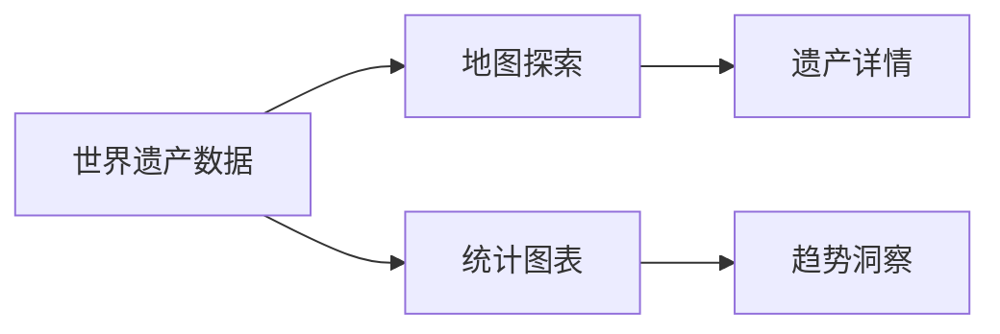

# World Heritage Atlas

一份面向世界遗产探索的交互式地图集演示

  项目演示 · Slidev

---
layout: two-cols-header
---

# 项目目标

::left::

## 探索

- 通过地图浏览世界遗产点位
- 按地区、类型、年份快速筛选
- 结合图表理解分布趋势

::right::

## 呈现

- 用交互式视图讲清文化与自然遗产
- 让数据探索更直观
- 支持后续扩展为专题叙事

---

# 技术栈

<v-clicks>

- React + TypeScript
- Vite 构建与开发服务
- Leaflet / React Leaflet 地图能力
- ECharts 数据可视化
- Framer Motion 交互动效
- Zustand 状态管理

</v-clicks>

---
layout: center
---

# 演示结构

---
layout: quote
---

# 下一步

把地图、数据筛选、图表和故事化解说串联起来，形成一份可演示、可扩展的世界遗产地图集产品说明。

---
layout: end
---

# 谢谢

World Heritage Atlas
